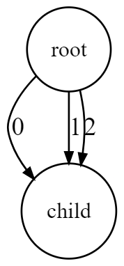
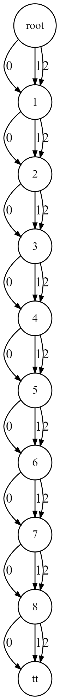

# 👓 Creating my first MDD from scratch

To make your first MDD, first go inside the Main file located in the :open\_file\_folder:dev module.

**Location** : `dev/src/main/java/Main.java`

In order to build a MDD, you have different options : either build it by manually adding nodes and arcs to the MDD, or use the :factory:MDDBuilder factory. In this section, I will show how to add nodes and arcs manually in order to build a universal MDD.


The :factory:MDDBuilder provides a variety of methods to build a MDD from a constraint definition. To know more about it, check the MDDBuilder page !


### Create a universal MDD of size 10

The first step is to allocate a new MDD. To do so, simply call the `create()`method from the MDD class. After allocating the MDD, you will have to set its size (= number of variables).

```java
MDD mdd = MDD.create();
mdd.setSize(10);
```

When allocating an MDD, it will automatically create a root node. You can access it via the `getRoot()`method. Once this is done, we will add a new node to the MDD at layer 1, and add arcs between the root and the newly created node.

<!-- tabs:start -->

#### **Code**

```java
Node root = mdd.getRoot();
Node child = mdd.Node();
mdd.addNode(child, 1);

// mdd.addArc(parent, value, child, layer of the parent)
mdd.addArc(root, 0, child, 0);
mdd.addArc(root, 1, child, 0);
mdd.addArc(root, 2, child, 0);
```

#### **Result**



<!-- tabs:end -->

To create a universal MDD, we have to repeat this operation for each node until we reach the last layer. Of course, it is possible to use a loop to automatise the process.

At the end of the construction process, we have to reduce the MDD : this operation ensures that the MDD is as small as possible, and also automatically set the reference of the tt (true terminal) node. In this example, we built the MDD in such way that it is not possible to reduce it further : in this case, the `setTT()`method is equivalent to the `reduce()` method.

<!-- tabs:start -->

#### **Code**

```java
// Allocating the MDD and setting its size
MDD mdd = MDD.create();
mdd.setSize(10);

// Defining the domain of the MDD.
int[] V = {0, 1, 2, 3};

// Adding nodes to the MDD
Node current = mdd.getRoot();
Node next;
for(int i = 1; i < mdd.size(); i++){
    next = mdd.Node();     // allocating a new Node
    mdd.addNode(next, i);  // adding it to the ith layer
    // Add an arc for each value in the domain, add an arc between two nodes current and next
    for(int v : V) mdd.addArc(current, v, next, i-1);
    current = next;
}

// Reduce the MDD
mdd.reduce();
```

#### **Result**



<!-- tabs:end -->

And this is it ! This is what you have to know to create a basic MDD !
