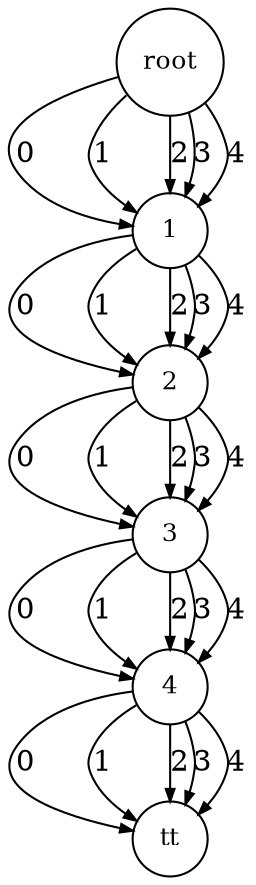

# MDD2Dot <!-- {docsify-ignore-all} -->
The MDD2Dot class is used to convert an MDD into a .dot file.  

?> For more information :  
• [DOT Language (Graphviz documentation)](https://www.graphviz.org/doc/info/lang.html)  
• [DOT Language (Wikipedia)](https://en.wikipedia.org/wiki/DOT_%28graph_description_language%29)


## Conversion
Simply call the static method `MDD2Dot.convert(MDD mdd, String filename)`. It will create the `filename.dot` file at the root of the program directory, in the `dot/` directory.  
> If the `dot/` directory does not exist, the function will automatically create it.


## Visualisation
To avoid dependencies on the main library, there are no way to visualise the .dot file created from the MDDLib.  
However, you can create the graph represented by the .dot file by installing and using [Graphviz](https://www.graphviz.org/) or by using the online [MDDViewer](https://jungvictor.github.io/MDDViewer/). The latter is more convenient for the user but is limited in term of computational power.

<!-- tabs:start -->

#### **Dot**

```
 digraph {
	graph [nodesep="0.3", ranksep="0.3",fontsize=12]
	node [shape=circle, fontsize=12]
	edge [arrowsize=0.6]

	0 [label="root"]
	1 [label="1"]
	2 [label="2"]
	3 [label="3"]
	4 [label="4"]
	5 [label="tt"]

	0->1 [label="0"]
	0->1 [label="1"]
	0->1 [label="2"]
	0->1 [label="3"]
	0->1 [label="4"]
	1->2 [label="0"]
	1->2 [label="1"]
	1->2 [label="2"]
	1->2 [label="3"]
	1->2 [label="4"]
	2->3 [label="0"]
	2->3 [label="1"]
	2->3 [label="2"]
	2->3 [label="3"]
	2->3 [label="4"]
	3->4 [label="0"]
	3->4 [label="1"]
	3->4 [label="2"]
	3->4 [label="3"]
	3->4 [label="4"]
	4->5 [label="0"]
	4->5 [label="1"]
	4->5 [label="2"]
	4->5 [label="3"]
	4->5 [label="4"]
}
```

#### **Graph**




<!-- tabs:end -->