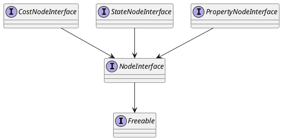
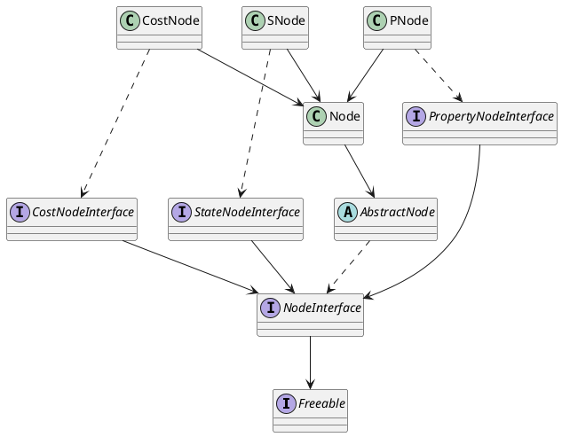

# Nodes <!-- {docsify-ignore-all} -->
Because of Java's restrictions of not supporting multiple inheritence, the library uses interfaces to implements the different types of nodes.  
In this section, we will see how the nodes are implemented and how the architecture works.

## Interfaces
There are basically four types of nodes implemented :  

* NodeInteface : The most essential type of node, only contains elementary functions. Every type of Node is implementing this interface ;
* StateNodeInterface : A node capable of holding a NodeState ;
* CostNodeInterface : A node capable of having a cost on its arcs ;
* PropertyNodeInterface : A node capable of having a property.

## Architecture of the Multi-Valued nodes

## Good practice

When dealing with nodes, the good practices is to always abstract as much as possible the type of the object you manipulate.  
For instance, if you manipulate a `CostNode`, it probably is better to manipulate the object as a `CostNodeInterface` if the behaviour you're trying to implement corresponds to every kind of node implementing the `CostNodeInterface`.  

!> In general, you never want to refer to the `AbstractNode` class, as it simply provides a common base code for all nodes implementing the `NodeInterface` interface. Therefore, it is better to directly refers to it as a `NodeInterface` node.

