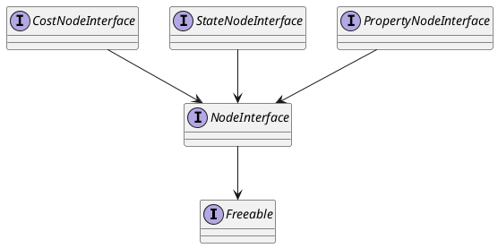
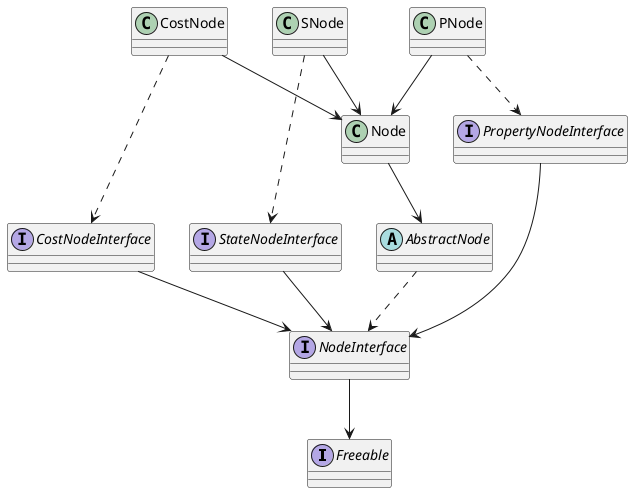

# Nodes <!-- {docsify-ignore-all} -->
Because of Java's restrictions of not supporting multiple inheritence, the library uses interfaces to implements the different types of nodes.  
In this section, we will see how the nodes are implemented and how the architecture works.

## Interfaces
There are basically four types of nodes implemented :  

	- NodeInteface : The most essential type of node, only contains elementary functions. Every type of Node is implementing this interface ;
	- StateNodeInterface : A node capable of holding a NodeState ;
	- CostNodeInterface : A node capable of having a cost on its arcs ;
	- PropertyNodeInterface : A node capable of having a property.

## Architecture of the Multi-Valued nodes

